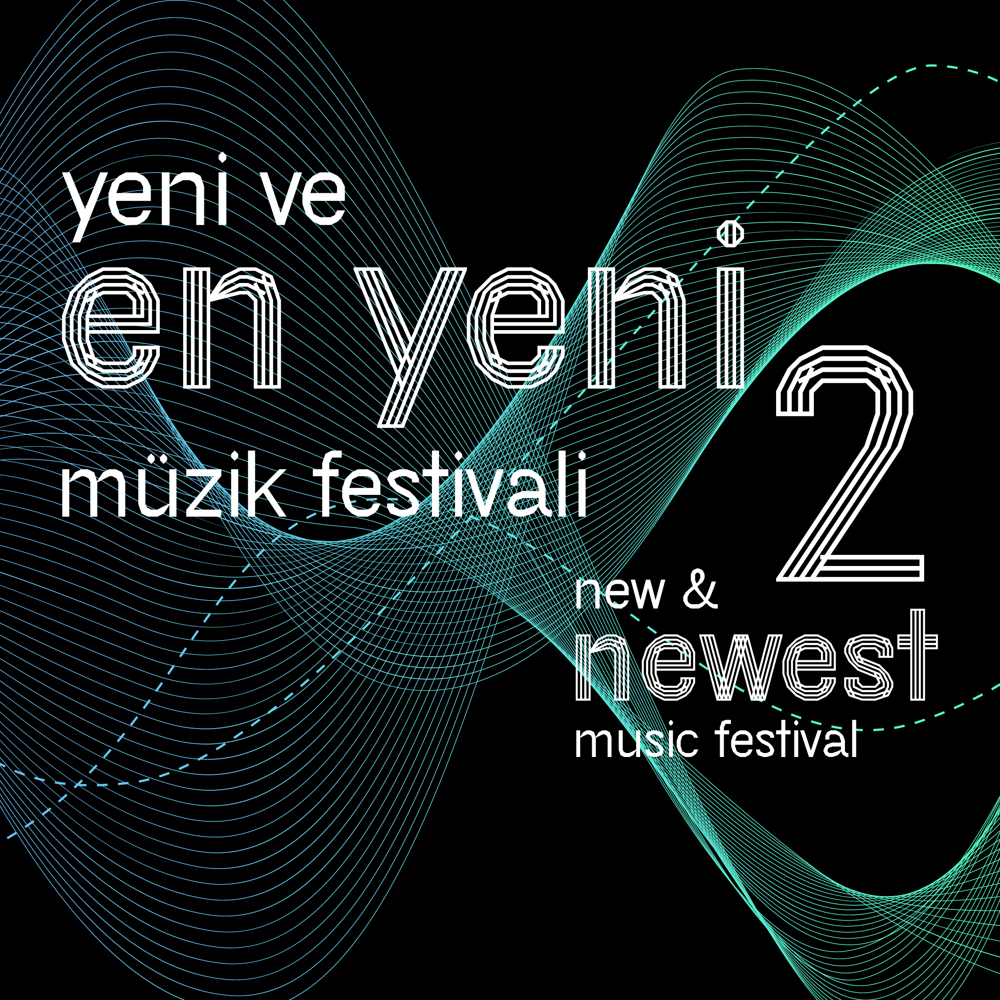
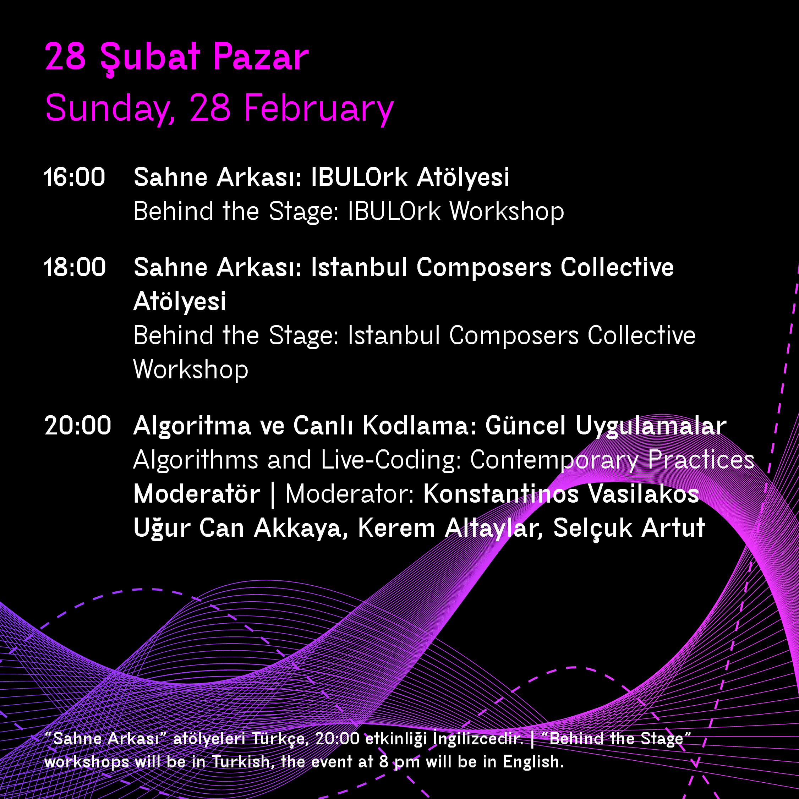

## [New Music Festival: Algorithms and Live-Coding: Contemporary Practices](https://www.arter.org.tr/en/algorithms-and-live-coding)

### Prolegomena
[Live Coding](https://toplap.org/about/), Just In Time programming Dynamic or interactive programming all refer to the act of improvising on stage with reprogrammable algorithms. Performers using programming languages to build or deconstruct source-code of running programs often exposing their decisions to the audience and building a sense of a virtuosic liveness similar to the open to the public _problem solving_ contests of the famous mathematicians such as Fior and Tartaglia or Fior and Ferrari. (Nilson, 2007).

> "For two millenia, the Knights Spacebar have hidden a terrible secret; a meeting of Greek dialectics and Renaissance mathematical contest. Now, semenitician Dr. Prof. Robot Langdon will uncover a sequence of clues through the medium of live coding semicolons, conclusively endangering himself and all of humanity in a roller coaster venture of Hollycode thrillerdom. Your mind will be recoded forever, and your body will be ours. We will invade your every pore with an outporing of alchemical uberprogramming designed to unseal the great reverberant multiplex and snore the central delimiti of metaphasatory ambidextrosity. The gathered multitude, led by Dance Towel, slob, Andrew Sorenscript and Alberti de Bassi will sing from a time of operating systems past. The Illuminati are here and they know how you code... hexecute..." (Nilson, 2016)

Of these, the _on the fly_ coding seems to have been the workhorse for diverse artistic forms of expression offering an interface with unprecended flexibility in the digital and time based arts, from music to real time audio/visual works and modern dance to creation of IDM, dance/club music and rave parties as well as being contributing on the research nuances of various laptop ensembles enabling networked collaborative performances resembling to the ethos of other directed improvised music genres, such as Jazz performance or _à la_ John Zorn's game pieces (Wilson et al., 2014).

Therefore, this discussion we will attempt to shed some light on various buzzes around live coding, such as being the future of electronic music, and esotericism and technical audience ecosystems etc. Henceforth, I would like to use these questions as impetus to open up the discussion with the invited speakers who will provide their own views about live coding and expand their perspective regarding this cutting edge performance paradigm.

Konstantinos Vasilakos

[Personal website](https://konvas.github.io/about/)

## Presenters

### Kerem Altaylar: "title of the presentation"
[Personal Webpage](...)

### Selcuk Artut
[Personal Webpage](https://www.selcukartut.com)
Social media: @selcukartut

[Find the whole presentation at this link](https://www.dropbox.com/s/5yyjt2sw6p9qj5i/SelcukArtut-NewMusicPresentation.pdf?dl=0)

Here are a few links to a selection of documentaries on Algorave and Live Coding Culture

[Algorave Generation Resident Advisor](https://www.youtube.com/watch?v=S2EZqikCIfY&ab_channel=ResidentAdvisor)

[Run the code: is algorave the future of dance music?](https://www.youtube.com/watch?v=h340aNznHnM&ab_channel=GuardianCulture)

[A short clip about my Live Coding Project RAW (Turkish)](https://www.youtube.com/watch?v=Fc1UozFJd-E&t=109s&ab_channel=Digilogue)

[Coding the Party: Algorave (with English Subtitles)](https://www.youtube.com/watch?v=BcbsDcZ9k-A&ab_channel=selcukartut)

### Ugur Can Akkaya
[Personal Webpage](https://www.researchgate.net/profile/Ugur-Akkaya)
Social media: @santilitre

[Complete presentation at this link](https://docs.google.com/presentation/d/10DulGGVKEMmsdiGbYEE6aY_sHEJLIoqdnXFUP0E7GPI/edit?usp=sharing)

Few live coding ensembles/groups/bands to check out:
- [Powerbooks Unplugged (Youtube Playlist) ](https://www.youtube.com/watch?v=OphvaU5oaJU&list=PLKRUGJaqJkAfU_PaYUeiRzD5qh5tkwvdj)
- [BEER (Birmingham Ensemble for Electroacoustic Research)](https://www.birmingham.ac.uk/facilities/ea-studios/research/beer.aspx)
- [Cybernetic Orchestra](https://global.mcmaster.ca/activity/cybernetic-orchestra/)
- [Benoit and the Mandlebrots](https://www.the-mandelbrots.de/)
- [Istanbul Coding Ensemble](https://konvas.github.io/ice/)

### Live Coding Resources
More about the live coding practice including tools and other available resources as follows:
- [TOPLAP: the home of live coding](https://toplap.org)
- [Tools and other useful resources](https://github.com/toplap/awesome-livecoding)
- [Algorave Community](https://algorave.com)

### References
Nilson, C. Collected Rewritings: Live Coding Thoughts, 1968-2015. Burntwood: Verbose.

Nilson, C. 2007. Live coding practice. In Proceedings of the 7th international conference on New interfaces for musical expression (NIME '07). Association for Computing Machinery, New York, NY, USA, 112–117. DOI:https://doi.org/10.1145/1279740.1279760.

Wilson, Scott, Norah Lorway, Rosalyn Coull, Konstantinos Vasilakos, and Tim Moyers. "Free as in BEER: Some Explorations into Structured Improvisation Using Networked Live-Coding Systems." Computer Music Journal 38, no. 1 (2014): 54-64. Accessed February 22, 2021. http://www.jstor.org/stable/24265532.
